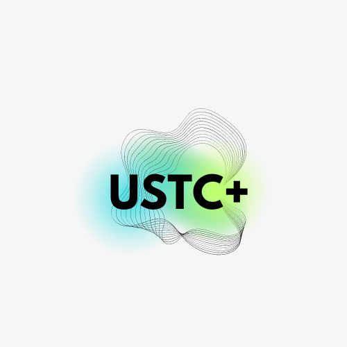

# USTC+ Core

**Let's get back USTC back!**

*For devs, this project uses the [Nexth](https://github.com/wslyvh/nexth) template. Nexth &ndash; A Next.js + Ethereum starter kit with Viem, Wagmi, Web3Modal, SIWE, Tailwind, daisyUI and more to quickly ship production-ready Web3 Apps*



## Packages 📦
`TODO change parts`

- [App](./packages/app) - Next.js 14, with App router
- [Hardhat](./packages/hardhat/) - EVM based smartcontracts projects


## Development 🛠️

1, Download and install all dependencies. This line of code in the terminal is executed only once.
```bash
npm install
```

2, Register on [Cloud.WalletConnect.com](https://cloud.walletconnect.com/) and get the project ID.
Create `app/.env` file based on `app/.env.sample`.
In the `app/.env` set `NEXT_PUBLIC_WALLETCONNECT_PROJECT_ID` to the project ID that you obtained from the WalletConnect cloud.

3, Run the website on your laptop and visit [localhost:3000](http://localhost:3000/)
```bash
npm run dev
```

## Deploy on Vercel 🚢

[](https://vercel.com/new/clone?repository-url=https%3A%2F%2Fgithub.com%ustc-plus%2Fcore)

The easiest way to deploy your Next.js app is to use the [Vercel Platform](https://vercel.com/new?utm_medium=nexth&filter=next.js&utm_source=nexth&utm_campaign=nexth-readme) from the creators of Next.js.

Check out our [Next.js deployment documentation](https://nextjs.org/docs/deployment) for more details.

During project setup, don't forget to set the environment variables that you set on `app/.env`.